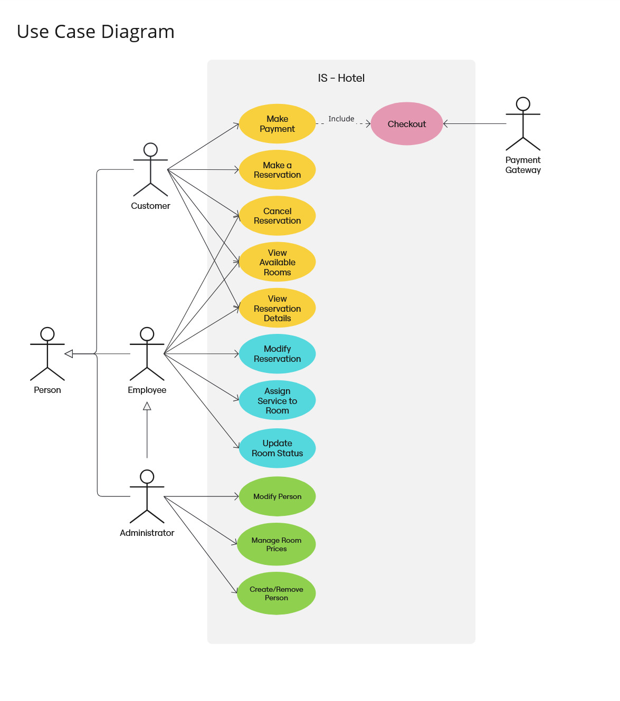

# Databázový Projekt: Hotel "U Škrečka na Koliesku"

## Popis Projektu

Tento projekt predstavuje návrh a implementáciu databázy pre správu hotelových operácií pre fiktívny hotel "U Škrečka na Koliesku". Cieľom projektu bolo navrhnúť robustný a flexibilný databázový model, ktorý pokrýva kľúčové aspekty riadenia hotela:

*   **Správa zamestnancov:** Evidencia zamestnancov s rôznymi pracovnými pozíciami a ich zodpovednosťami.
*   **Správa izieb:** Katalóg izieb s rôznymi kategóriami kvality (Basic, VIP, Deluxe atď.), vybavením a stavom dostupnosti.
*   **Správa rezervácií:** Proces vytvárania, úpravy a rušenia rezervácií zákazníkmi aj zamestnancami. Zohľadnenie dostupnosti izieb, dátumov a doplnkových služieb.
*   **Správa platieb:** Evidencia platieb súvisiacich s rezerváciami, vrátane celkovej ceny, spôsobu a dátumu platby.
*   **Správa služieb:** Ponuka doplnkových služieb, ktoré si zákazníci môžu pridať k rezervácii.
*   **Sledovanie prístupu do izieb:** Záznamy o vstupe zamestnancov do izieb (pre účely upratovania, údržby, kontroly), vrátane času a dôvodu vstupu.

Databáza bola navrhnutá s dôrazom na integritu dát, bezpečnosť a podporu bežných hotelových procesov.

## Diagramy

### ER Diagram

Entitno-relačný diagram znázorňuje štruktúru databázy, entity a vzťahy medzi nimi.

### Diagram Prípadov Použitia (Use Case Diagram)

Diagram prípadov použitia ilustruje, ako rôzni používatelia (herci) interagujú so systémom databázy a aké funkcie môžu vykonávať.

## Implementácia (SQL)

Implementácia databázy je obsiahnutá v súbore `hotel_database.sql`. Skript zahŕňa:

*   **DROP statements:** Príkazy na zmazanie existujúcich tabuliek a materializovaných pohľadov pre čistú inštaláciu.
*   **CREATE TABLE statements (DDL):** Definície všetkých tabuliek (`Person`, `PositionType`, `Services`, `Reservation`, `Room`, `Room_type`, `Price_in_date`, `Managed_by`, `Equipment`, `Payment`, `Includes`, `Assigned_to`) s definíciou stĺpcov a primárnych kľúčov.
*   **ALTER TABLE statements:** Definície cudzích kľúčov (`FOREIGN KEY`) a kontrolných obmedzení (`CHECK CONSTRAINT`) pre zabezpečenie integrity dát (napr. formát telefónu/emailu, platnosť dátumov, minimálne hodnoty, povolené stavy).
*   **INSERT statements (DML):** Vloženie počiatočných dát do všetkých tabuliek na demonštráciu funkcionality.

## Rozšírené Databázové Funkcionality

Skript `hotel_database.sql` demonštruje použitie viacerých pokročilých databázových konceptov:

### Triggers

*   **`trg_update_room_on_checkout`:** Trigger, ktorý sa automaticky spustí po zmene stavu rezervácie na 'Completed' alebo 'Checked-out'. Jeho úlohou je aktualizovať stav príslušnej izby na 'Cleaning'.
*   **`trg_insert_time_accessed_into_managed_by`:** Trigger, ktorý sa spustí pred vložením nového záznamu do tabuľky `Managed_by` a automaticky nastaví stĺpec `timeAccessed` na aktuálnu systémovú časovú známku.

### Procedúry (Stored Procedures)

*   **`showAvailableRooms`:** Procedúra, ktorá vyhľadáva dostupné izby na základe viacerých voliteľných kritérií, ako sú typ izby, kapacita, dátumy pobytu, cenové rozpätie a vybavenie. Vypíše zoznam vyhovujúcich izieb s informáciami o cenovom období a cene. Procedúra obsahuje validáciu vstupných parametrov a ošetrenie chýb.
*   **`showRoomsWithEmployeesHistory`:** Procedúra, ktorá zobrazuje históriu prístupov zamestnancov/administrátorov k izbám. Umožňuje filtrovať podľa mena/priezviska osoby, typu izby a časového rozsahu činnosti. Vypíše detailné záznamy o tom, kto, kedy a prečo manipuloval s danou izbou.

### Common Table Expressions (WITH klauzula)

Skript obsahuje komplexný dotaz využívajúci `WITH` klauzulu na výpočet vernostného statusu zákazníkov. Tento dotaz analyzuje historické rezervácie a platby zákazníkov a na základe definovaných prahov (počet rezervácií alebo celková útrata) priraďuje zákazníkom vernostnú úroveň (Bronze, Silver, Gold, Platinum, Diamond, Obsidian).

### Indexy a EXPLAIN PLAN

Pre optimalizáciu výkonu dotazov boli vytvorené indexy na často používané stĺpce, napr. pre vyhľadávanie rezervácií podľa dátumov (`idx_reservation_dates`) a pre zrýchlenie agregačného dotazu s tabuľkou `Assigned_to` (`idx_assigned_to_reser`). V skripte sú demonštrované príkazy `EXPLAIN PLAN` a ich výstup pomocou `DBMS_XPLAN.DISPLAY`, ktoré ukazujú, ako databázový optimalizátor využíva tieto indexy na zrýchlenie vykonávania dotazov.

Ukážky sú zahrnuté v SQL skripte.

### Prístupové Práva (Grants) a Materializovaný Pohľad

Projekt zahŕňa demonštráciu zdieľania dát medzi rôznymi databázovými schémami (predpokladá sa hlavná schéma, v ktorej sú vytvorené tabuľky, a sekundárna schéma, ktorá k nim pristupuje).

*   **Grants:** Príkazy `GRANT SELECT ON ... TO [sekundárna schéma];` udeľujú sekundárnej schéme právo čítať dáta z tabuliek hlavnej schémy.
*   **Materializovaný Pohľad:** V sekundárnej schéme je vytvorený materializovaný pohľad, ktorý predpočítava dáta o vernostnom statuse zákazníkov z tabuliek v hlavnej schéme. Tento pohľad je nastavený na `REFRESH COMPLETE ON DEMAND` a slúži na rýchlejšie získanie prehľadu o vernosti zákazníkov bez nutnosti zakaždým spúšťať zložitý výpočet s `WITH` klauzulou.

## Inštalácia a Spustenie

Pre spustenie tohto projektu potrebujete databázový systém Oracle.

1.  Pripojte sa k vašej Oracle databáze (napr. pomocou SQL Developer, SQL*Plus, alebo iného klienta).
2.  Skript je navrhnutý na spustenie primárne pod jednou databázovou schémou (označme ju ako hlavná schéma).
3.  Ak chcete otestovať aj časť s prístupovými právami a materializovaným pohľadom, vytvorte druhú schému (sekundárna schéma) a uistite sa, že hlavná schéma má právo udeľovať práva (`GRANT OPTION`).
4.  Otvorte súbor `hotel_database.sql` v SQL klientovi pripojenom ako používateľ hlavnej schémy.
5.  Spustite prvú časť skriptu, ktorá zahŕňa vytváranie tabuliek, vkladanie dát, triggerov, procedúr a indexov.
6.  Druhá časť skriptu s materializovaným pohľadom a prístupovými právami je oddelená a označená ako `CONNECT [sekundárna schéma]/[heslo];`. Pred spustením tejto časti sa uistite, že ste pripojení ako používateľ sekundárnej schémy a upravte prípadné prihlasovacie údaje a názvy schém. Táto časť vytvorí materializovaný pohľad v sekundárnej schéme a ukáže, ako sa na neho dotazovať. Taktiež ukazuje príklady priamych dotazov zo sekundárnej schémy na tabuľky v hlavnej schéme.
